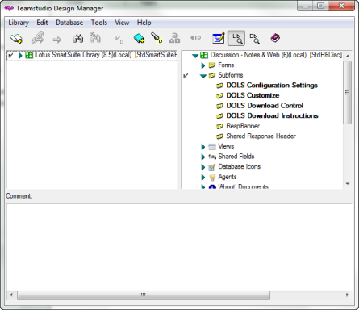

# About Template Inheritance

By default, when you copy a design element from a Notes template in the left pane using drag-and-drop, Design Manager will template-link the copied element to the template. In other words, the resulting element is set up to inherit its design from the original template.

## To copy without template inheritance using drag-and-drop
You can override the default behavior, copying an element to a new database from the template without maintaining the inheritance as follows.

1. Choose **Tools** from the **Design Manager** menu bar.
2. Choose **Inherit Design on Copy** to clear the checkmark.
3. Drag-and-drop the element.  
   The element is not linked to the originating template. 
 
You can also use the following toolbar buttons to copy elements from the left pane to the right pane, with or without inheritance:

 This button copies selected design element(s) from the library pane to all selected databases in the database pane, *maintaining* template inheritance.  
  This button copies selected design element(s) from the library pane to all selected databases in the database pane, *without maintaining* template inheritance.

Elements linked to a template display in bold typeface in both the left and right panes; elements not linked to a template display in a normal typeface. 
<figure markdown="1">
  
</figure>
