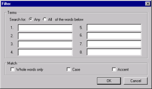
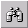
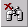

# ライブラリフィルタを使用した、表示される要素の絞り込み

ライブラリフィルタを使用して検索し、左側のペインをフィルタ処理します。ライブラリフィルタはテキストに基づく検索で、左側のペインに表示される項目を、検索基準に一致するものだけに限定します。

このフィルタを指定すると、全ライブラリの設計要素すべてが検索の対象となります。検索対象には、各要素の名前だけでなくその内容も含まれるため、フィールド名やロータススクリプトのサブルーチンを検索に含めることができます。

## フィルタをセットアップするには
1. **[ ライブラリ ]** メニューから **[ フィルタ ]** を選択します。**[ フィルタ ]** ウィンドウが表示されます。  
   
2. 番号の付いたフィールドに、検索する語句(1~8語)を入力します。
    * 入力した語句のいずれかに一致させる場合は、**[どれか]**オプションをオンにします。
    * 入力した語句のすべてに一致する設計ノートだけに限定する場合は、**[ すべて ]** オプションをオンにします。
3. 次のチェックボックスからオプションを選択することにより、検索をさらに絞り込むことができます。  
   <table>
     <tr><th>チェックボックス</th><th>説明</th></tr>
     <tr><td>全単語の一致</td><td>スペースまたは句読点で囲まれた単語だけを検索する。</td></tr>
     <tr><td>大文字と小文字を区別</td><td>大文字と小文字を区別する。</td></tr>
     <tr><td>濁点/半濁点を区別</td><td>は/ば/ぱなどを区別する。</td></tr>
   </table>
 
選択基準を設定した後、**[OK]**をクリックして検索を開始します。

検索が完了すると、左側のペインに設定基準を満たす設計要素だけが表示され ます。

 **[ ライブラリ ] > [ フィルタ ]** のショートカットとして、**[ フィルタ ]** ツー ルバーボタンを使うこともできます。

## フィルタをクリアするには
* フィルタをクリアするには、**[ ライブラリ ]** メニューの **[ フィルタをクリア ]** を選択します。

 **[ライブラリ]** メニューの **[開く]** のショートカットとして、**[フィルタをクリア]** ツールバーボタンを使うこともできます。