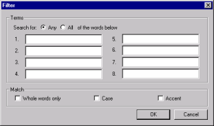
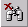

# Using Library Filters

Use the *library filter* to search, then filter the left pane. A library filter is a text- based search that restricts the entries in the left pane to just those that match your search criteria.

When you specify a filter, Design Manager searches all design elements in all libraries for a match. Because this search includes the contents of each element, rather than just its name, you can include searches for field names and LotusScript subroutines.

## To set up a filter
1. Choose **Filter** from the **Library** menu. You see the **Filter** window.  
   
2. In the numbered fields, enter one to eight terms to search for.
    * To match by any of the words you entered, click the **Any** option.
    * To restrict search matches to only those design notes where all of the text items match, click the **All** option.
3. Further define the search by selecting the options you want from the following check boxes:  
   <table>
     <tr><th>Check Box</th><th>Description</th></tr>
     <tr><td>Whole words only</td><td>Only matches if the words are surrounded by white space (or punctuation).</td></tr>
     <tr><td>Case</td><td>Switches case sensitivity on.</td></tr>
     <tr><td>Accent</td><td>Switches sensitivity on for accented characters.</td></tr>
   </table>
 
When you are satisfied with your selection criteria, click **OK** to begin the search.

When the search completes, the left pane shows only those design elements that match the criteria you defined.

 Use the **Filter** toolbar button as a shortcut to the **Library>Filter** command.

## To clear the filter
* To clear the filter, choose **Clear Filter** from the **Library** menu.

 Use the **Clear Filter** toolbar button as a shortcut to the **Library > Clear Filter** command.