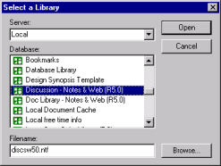

# ライブラリを開く

ライブラリは、左側のペインで開くノーツテンプレートまたはデータベースであり、右側のペインのデータベースにコピーできる再利用可能な要素が保持されます。どのデータベースまたはテンプレートでもライブラリとして開くことができます。

## ライブラリを開くには
1. **[ ライブラリ ]** メニューから **[ 開く ]** を選択します(または、**[ ライブラリ ] > [ 最近使ったファイル ]** をクリックして、最近使用した 10 個のライブラリから選択します)。
   ローカルデータディレクトリにあるデータベースとテンプレートの一覧が表示されます。
2. サーバーを選択してネットワーク上のライブラリを表示するか、ローカルサーバーを使用します。  
   データベース一覧に、選択したサーバー上のデータベースとテンプレートの一覧が表示されます。  
      
    **[ ライブラリ ]** メニューの **[ 開く ]** のショートカットとして、**[ ライブラリ を開く ]** ツールバーボタンを使うこともできます。
3. データベース一覧で、ライブラリとして使用するテンプレートまたはデータベースを選択します。
4. **[ 開く ]** をクリックします。  
   左側のペインに、ライブラリ要素が表示されます。

ライブラリを一度開くと、次回から一覧で再びライブラリを選択する必要はありません。次回 Design Manager を起動すると、前回と同じライブラリが自動的に開きます。