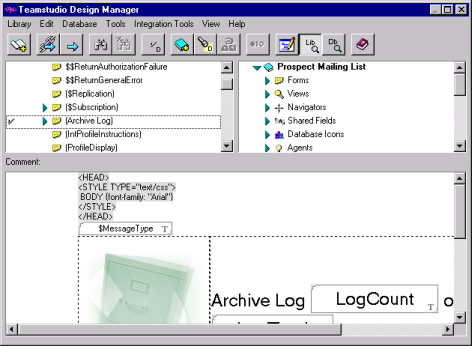
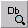
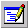

# ビジュアル要素のプリビュー

Design Manager で選択した要素を操作する場合、プリビューペイン(画面下のペイン)には特定の要素タイプの外観が表示されます。
<figure markdown="1">
  
</figure>

## ログビューからプリビューモードに切り替えるには
* **[ ビュー ]** メニューから、**[ ライブラリプリビュー ]** または **[ データベースのプリビュー ]** を選択します。  
   **[ 表示 ] > [ ライブラリプリビュー ]** のショートカットとして、**[ ライブラリプ リビュー ]** ツールバーボタンを使うこともできます。  
   **[ 表示 ] > [ データベースのプリビュー]** のショートカットとして、**[ データベースのプリビュー ]** ツールバーボタンを使うこともできます。 

**[ ライブラリプリビュー ]** を選択すると、左側のペインで選択した要素のプリビューがプリビューペインに表示されます。**[ データベースのプリビュー ]** を選択すると、右側のペインで選択した要素のプリビューがプリビューペインに表示されます。
 
!!! note
    左側または右側のペインのいずれかで任意の要素をクリックすると、画面下のペインが自動的に適切な表示に切り替わり、選択要素が表示されます。
    
 
## プリビューモードからログモードに切り替えるには
* **[ 表示 ]** メニューから **[ ログ ]** を選択すると、プリビューペインがログモードに 変更され、Design Manager のアクションの記録が表示されます。  
   **[ 表示 ] > [ ログ ]** のショートカットとして、**[ ログ ]** ツールバーボタンを使うこともできます。
 