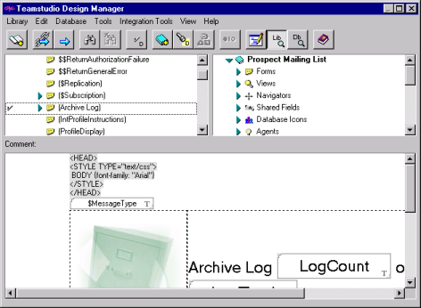
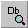

# Previewing Visual Elements

As you work with select elements in Design Manager, the *preview pane* (the bottom pane) shows you how certain element types will look. 
<figure markdown="1">
  
</figure>

## To switch from the Log view to the Preview mode
* From the **View** menu, choose either **Library Preview** or **Database Preview**.  
   Use the **Library Preview** toolbar button as a shortcut to the **View > Library Preview** command.  
   Use the **Database Preview** toolbar button as a shortcut to the **View > Database Preview** command. 

When you choose **Library Preview**, the Preview pane shows a preview of the element that you selected from the left pane. When you choose **Database Preview**, the Preview pane shows a preview of the element you have selected from the right pane.
 
!!! note
    Click any element in either the left or right pane. This automatically switches the bottom pane to the appropriate view, with the selected element displayed.
 
## To switch from the Preview mode to the Log mode
* Choose **Log** from the View menu to switch the Preview pane back to the Log mode. You will see a text log of Design Manager's actions.  
   Use the Log toolbar button as a shortcut to the View > Log command. 
 