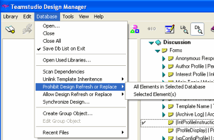
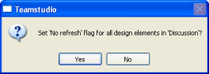

# 再設計または設計の置換の禁止／許可

1 つ以上のデータベースに存在する要素に対し、再設計または設計の置換を禁止できます。

## 再設計または設計の置換を禁止/許可するには
1. 右側のペインで、要素またはデータベースを1つ以上選択します。
2. **[ データベース ] > [ 再設計/設計の置換を禁止(または許可)する ]** をクリックします。
3. **[ 選択データベース全体 ]** または **[ 選択要素 ]** を選択します。  
     
   1 つ以上のデータベースを選択した場合、データベースごとに次のウィンドウ が表示されます。  
   
4. **[ はい ]** をクリックして、適用します。