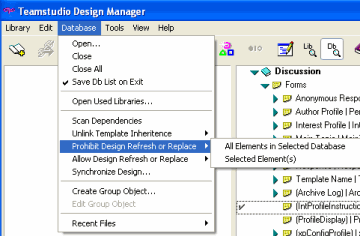
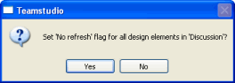

# Prohibiting Design Refresh or Replace

You can prohibit design refresh or replace on elements in one or more databases. 

## To prohibit/allow design refresh or replace
1. In the right pane, select your element(s) or Database(s).
2. Click **Database > Prohibit** (or **Allow**) **Design Refresh or Replace**.
3. Select **All Elements in Selected Database** or **Selected Element(s)**.  
     
   If you selected one or more database, you see the following window for each database:  
   
4. Click **Yes** to accept.