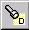
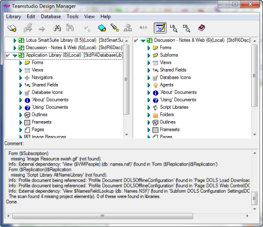
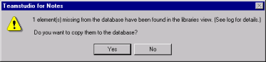

# 欠落した従属要素のスキャン

Design Manager では、スキャンして、データベース設計で欠落している従属 要素を検索することができます。たとえば、サブフォーム B を使っている フォーム A をライブラリからデータベース設計にコピーする際、サブ フォーム B をコピーしなかったとします。このような場合、従属要素のス キャンを使用して、フォーム A で欠落している従属要素を検出することが できます。

欠落した従属要素をスキャンするには、少なくとも 1 つのデータベースを 選択し、**[ データベース ]** メニューの **[ 従属要素をスキャン ]** を選択します。

 **[ データベース ]** メニューの **[ 従属要素をスキャン ]** のショートカットとして、 **[ 従属要素をスキャン ]** ツールバーボタンを使うこともできます。

Design Manager により、選択したすべてのデータベースの従属要素がスキャ ンされます。複数のデータベースを選択した場合、1 度に 1 つのデータベー スが処理され、データベースごとに欠落した従属要素を示すプロンプトが 表示されます。少なくとも 1 つのデータベースを選択している必要があります。

欠落した従属要素のスキャンが完了すると、ログペインにその結果が表示されます。
<figure markdown="1">
  
</figure>

開いているライブラリがスキャンされ、欠落した従属要素の名前に一致する要素が検索されます。一致する要素が検出された場合、欠落した要素を データベースにコピーして従属に関する問題を解決するオプションを選択できます。
<figure markdown="1">
  
</figure>

!!! note
    ライブラリペインに一覧表示されたデータベースのみスキャンされます。
