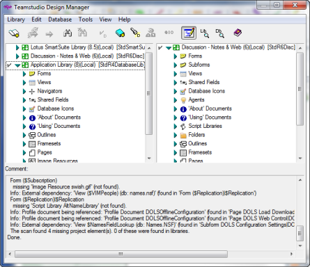

# Scanning for Missing Dependencies

With Design Manager, you can scan to find any dependent elements that are missing from a database design. For example, if you copied Form A, which uses Subform B, from a library into a database design, but you did not also copy Subform B, you can scan for dependencies to detect the missing dependency. 

To scan for missing dependencies, select at least one database and choose **Scan Dependencies** from the **Database** menu. 

 Use the **Scan Dependencies** toolbar button as a shortcut to the **Scan Dependencies** command on the **Database** menu. 

Design Manager scans for dependencies in all selected databases. If you select more than one database, Design Manager processes one database at a time and prompts you for any missing dependencies in each database. You must select at least one database. 

When Design Manager has finished scanning for missing dependencies, you see the search results in the Log pane.
<figure markdown="1">
  
</figure>

Design Manager scans the open libraries for elements matching the names of the missing dependencies. If Design Manager finds the matching element, it gives you the option to copy the missing element to the database to resolve the dependency.
<figure markdown="1">
  
</figure>

!!! note
    Design Manager only scans those databases that are listed in the Library pane.
