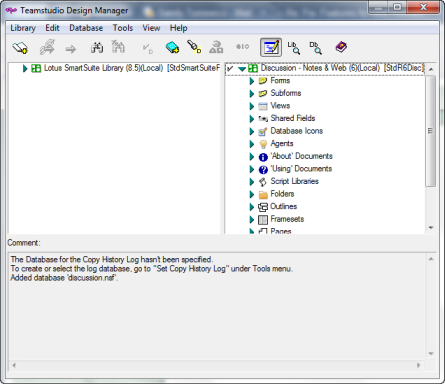

# Design Manager の起動

Designer でノーツデータベースを開き、ツールバーの [Design Manager] ボタンをクリックします。

起動時に、次のような Design Manager メインウィンドウが現れます。 

<figure markdown="1">
  
</figure>

Design Manager ウィンドウは次のペインに分かれています。

| ペイン | 説明 |
| --- | --- |
| 左側 | **[ ライブラリ ] > [ 開く ]** コマンドを使用すると、左側のペインでテンプレートやデータベースが開きます。左側のペインは読み取り専用の領域で、ここから右側のペインに表示したデータベースやテンプレートに要素をコピーできます。読み取り専用領域に表示されたデータベースやテンプレートをライブラリとして参照できます。開いているライブラリがあると、各ライブラリの設計要素が左側のペインに表示されます。 テンプレートにリンクされた要素が太字でこのペインに表示されます。 詳細については、[ テンプレートの引き継ぎについて](inheritance.md)を参照してください。 |
| 右側 | **[ データベース ] > [ 開く ]** コマンドを使用すると、右側のペインでテンプレートやデータベースが開きます。右側のペインでは、要素を追加または削除できます。要素を追加するには、左側のペインから右側のペインに目的の要素をコピーします。  テンプレートにリンクされた要素が太字でこのペインに表示されます。詳細については、[ テンプレートの引き継ぎについて](inheritance.md) を参照してください。 CIAO! によって監視されるデータベースの横には、CIAO! アイコンが表示されます。 |
| 下 | 画面下のペインは多目的の領域で、デフォルトではログエントリが表示されます。Design Manager が実行した操作の履歴がわかるようになっています。このペインを使って、フォーム、サブフォーム、ナビゲータ、データベースアイコン、ヘルプ文書など、ビジュアルな設計要素のプリビューを表示することもできます。左側または右側のペインで要素を選択した場合、画面下のペインでプリビューできます。 |

!!! note
    [ **編集** ] メニューから [ **コピー** ] を選択するか、**CTRL+C** キーを押すと、ログペインのテキストをクリップボードにコピーできます。コピーしたテキストは別の場所に貼り付けることができます。