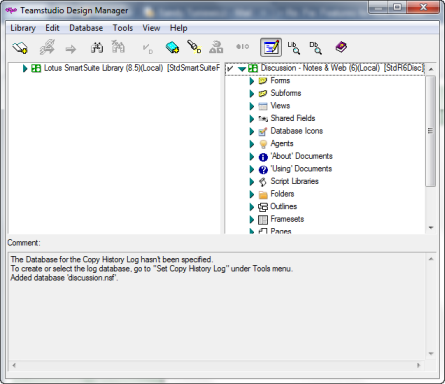

# Starting Design Manager

In Designer, open a Notes database and then click the Design Manager button on the toolbar.

Once Design Manager has started, you see the Design Manager main window.

<figure markdown="1">
  
</figure>

The Design Manager window is divided into the following panes:

| Pane | Description  |
| --- | --- |
| Left | You use the **Library>Open** command to open any template or database in the left pane. The left pane is a read-only area from which you can copy elements to databases or templates you display in the right pane. You can refer to databases or templates you see in the read-only area as libraries. When you have one or more libraries open, the design elements in each library are listed in the left pane. Template-linked elements appear bolded in this pane. See [About Template Inheritance](inheritance.md), for more information. |
| Right | You use the **Database>Open** command to open any template or database in the right pane. You can add or delete elements in the right pane. To add elements, you copy the elements you want from the left pane into the right pane. Template-linked elements appear bolded in this pane. See [About Template Inheritance](inheritance.md), for more information. The CIAO! icon appears beside databases that are watched by CIAO!. |
| Bottom | The bottom pane is a multi-purpose area that, by default, displays log entries. Log entries give you a history of the operations that Design Manager has executed. You can also use this pane to preview visual design elements (forms, sub-forms, navigators, database icons, help/about and help/using documents). If you select an element in the left or right pane, you can preview it in the bottom pane. |

!!! note
    You can copy text in a Log pane to the clipboard by choosing **Copy** from the **Edit** menu, or pressing **CTRL+C** on your keyboard. You can then paste that text to another location.