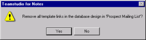

# テンプレートの引き継ぎのリンク解除

次の手順で、1 つ以上のターゲットデータベース内のすべてのテンプレートリンクを削除できます。 

## データベースのテンプレートの引き継ぎをリンク解除するには
1. 少なくとも1つのデータベースを選択します。
2. **[ データベース ]** メニューから、**[ テンプレートへのリンクを解除 ] > [ 選択デー タベース全体 ]** を選択します。  
   
3. **[ はい ]** をクリックし、確定します。  
   

すべての選択したデータベースに対するテンプレートの全リンクが解除されます。 

## 選択した要素のテンプレートの引き継ぎをリンク解除するには
1. 右側のペインで項目を選択します。
2. 次のいずれかを行います。
    * **[ データベース ]** メニューから、**[ テンプレートへのリンクを解除 ] > [ 選択要素 ]** を選択します。
    * テンプレートから関連付けられた要素のリンクを解除する場合、右側のペインで選択要素を右クリックし、ショートカットメニューの **[ 選択要素のリン クを解除 ]** を選択します。

選択した要素のリンクだけがテンプレートから解除されます。ターゲットデー タベース設計にある他のテンプレートリンクはそのまま残ります。