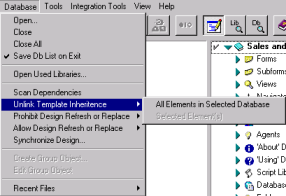
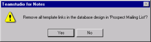

# Unlinking Template Inheritance

You can remove all template links in one or more target databases as follows: 

## To unlink template inheritance for a database
1. Select at least one database.
2. From the **Database** menu, choose **Unlink Template Inheritance > All Elements in Selected Database**.  
   
3. Click **Yes** to confirm.  
   

All links to templates for all selected databases are removed. 

## To unlink template inheritance for selected element(s)
1. Select the items in the right pane
2. Do one of the following:
    * From the **Database** menu, select **Unlink Template Inheritance > Selected Element(s)**.
    * Right-click a selected element in the right pane, and then choose **Unlink Selected Element(s)** from the shortcut menu to unlink that element from the template it was associated with.

Only those items you've selected are unlinked from their templates. All other template links in the target database design remain intact.