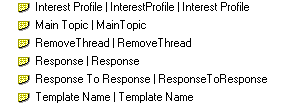
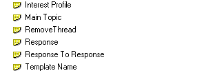

# Viewing Elements

Use **Expand/Collapse All** on the **View** menu to view the sub-elements of a database or library.

Alternatively, select the database or library for which you want to view sub- elements, and right-click to display the short-cut menu. Then click **Expand All** or **Collapse All**.

You can click the twisties at each hierarchical level, or use the following keyboard shortcuts to quickly expand and collapse the twisties.

| Shortcut | Usage |
| --- | --- |
| * | Expand All |
| + | Expand |
| - | Collapse |

## Viewing Aliases
Click the **Show Alias** command on the **View** menu to view alias names in both the left and right panes.

This is with **Show Alias** enabled.
<figure markdown="1">
  
</figure>

This is with **Show Alias** disabled.
<figure markdown="1">
  
</figure>