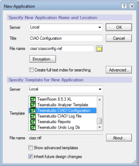
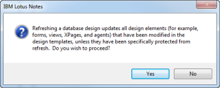

# CIAO! クライアント - 追加説明

CIAO! クライアント版をインストールする場合、始めにご利用のNotesバージョンに沿った前述の説明をご確認ください。その後、以下の追加ステップに従い作業を進めてください。

## インストール手順
こちらのワークグループに初めてCIAO! クライアント版をインストールする場合、CIAO! 設定データベースを作成する必要があります。CIAO! 設定データベースはご利用のデータベース設計と同じサーバーに設置する必要があります。

1. (シングルユーザーではなく)ワークグループへCIAO!をインストールするために、ワークグループの全てのメンバーがアクセス可能なNotes/Dominoサーバー上へCIAO! 設定データベースを作成します。
    1. 新しいデータベース名を右の通りにします: **ciao\ciaoconfig.nsf**
    2. CIAO! 設定テンプレ―ト (**ciao.ntf**)を指定します。
    3. テンプレートを引き継いで設計 チェックボックスを選択します。
       
    4. **OK** をクリックし作成します。
    
通常はNotesサーバーへこれらのデータベースを作成しますが、ローカルへ作成することも可能です。(テストをするためなど)

## アップデートインストールの後
Teamstudio製品への更新をインストールした後は、以前のバージョンで作成されたCIAO! 設定とログデータベースのデザインが最新の設計を参照するようにしなければなりません。

### データベースの設計を更新するために
1. Notesワークスペースからデータベースを選択、もしくは直接データベースを開きます。
2. ファイル > アプリケーション > 設計の更新 を選択します。
3. サーバーを選択し、**OK** をクリックします。

設計の更新による影響に関してのダイアログメッセージが表示されます。
<figure markdown="1">
  
</figure>
はい をクリックします。

CIAO! 設定とログデータベースを最新のデザインテンプレートにより更新します。 
