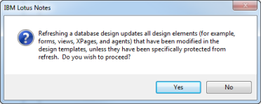

# CIAO! Special Instructions

If you are installing CIAO! Client Edition, first use the instructions described earlier for your version of Notes. Then follow these additional steps.

## Installation Procedure
If this is the first time you have installed CIAO! Client Edition for this workgroup, you must create a CIAO! configuration database. The CIAO! configuration database should be on the same server as your database designs.

1. To install CIAO! for a workgroup (rather than for a single user), create this database on a Notes/Domino server that can be accessed by all members of the workgroup.
    1. Give the new database the name: **ciao\ciaoconfig.nsf**
    2. Base the design on the CIAO! Configuration template (**ciao.ntf**).
    3. Select the *Inherit future design changes* check box.  
       
    4. Click **OK** to create.
    
Although you normally create these databases on a Notes server, you can optionally create them locally (for example, for testing.)

## After Installation of an Update
After installing an update to Teamstudio products, you must refresh the design of your CIAO! Configuration and Log databases that were created by prior release templates.

### To Refresh Your Database's Design
1. Select your database from the Notes Workspace or open it.
2. Click **File > Application > Refresh Design**.
3. Select your server. Then, click **OK**.

You see a message informing you about potential effects of the refresh and asking you to confirm.
<figure markdown="1">
  
</figure>
Click **Yes**.

The designs of your CIAO! Configuration and Log databases have been updated to the latest design templates. 
