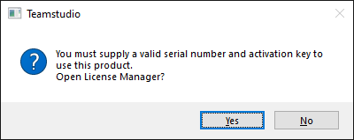
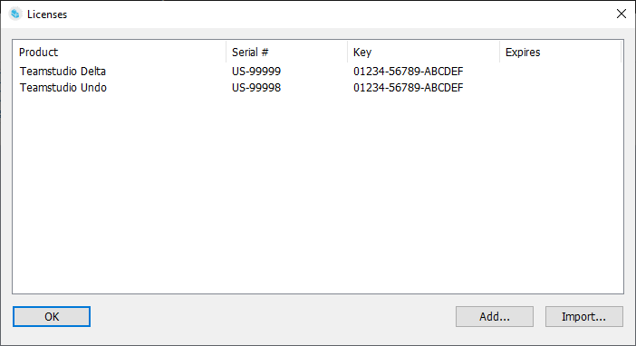

# Teamstudio Tools の初期化

Teamstudio の各クライアント製品はシリアル番号とキーで保護されているため、ご利用になる前に Teamstudio のクライアント製品を設定しなければなりません。ご購入頂いたお客様へはクライアント製品のシリアル番号とキーのライセンスを発行しています。

## Teamstudio クライアント製品の初期化
1. Designer から初期化したいツールのアイコンをクリックします。
2. ライセンスマネージャーを開くかどうかのメッセージが表示されます。 
     
   *いいえ*を選択するとツールは終了します。
3. ライセンスマネージャーが表示されます。現在このコンピューターにインストールされているすべての製品のシリアル番号とキーを表示します。  
     
   サブスクリプションライセンスの場合、*有効期限*の列にそれぞれの有効期日が表示されます。
4. 新規のライセンス情報を追加する最も簡単な方法は、チームスタジオから提供されたシリアル番号とキーの情報を含むEメールから、Eメール全体をクリップボードにコピーする方法です。コピー後にライセンスマネージャーに戻り、*インポート...*ボタンをクリックしてください。続いてEメールに記述されているすべてのキー情報を表示するウィンドウが表示されます。*選択をインポート*をクリックして新しいキー情報をインポートして、続いて *OK* をクリックしてこの*ライセンスのインポート*ウィンドウを閉じます。
5. Eメールがない場合やキーを手動で入力したい場合には、*追加...*ボタンをクリックし新しいライセンスを追加するためのウィンドウを開きます。一回について一製品の登録となります。
6. また既存のライセンスを右クリックすると、ライセンスを編集したり削除することができます。新しいライセンスをインポートする前に既存のものを削除しておく必要はありません。インポートされたライセンス情報は自動的に古いものから置き換わります。
7. 必要な変更が完了したら *OK* をクリックしてライセンスマネージャーを閉じます。ツールが利用できるようになります。

## シリアル番号とキーの更新
ライセンス情報を更新するのにいつでもライセンスマネージャーにアクセスできます。こちらで古いキーが期限切れになる前にキーを更新することができます。

このライセンスマネージャーは製品ダイアログからも利用できます。ほとんどの製品では、メインのツールウィンドウから*バージョン情報...*ボタンから起動できます。バージョン情報のダイアログが表示され*ライセンス...*ボタンでライセンスマネージャーを起動します。

!!! note
    このライセンスマネージャーはチームスタジオクライアント製品のすべてのシリアル番号とキーを更新できますが、キーが*有効か*どうかを判定するものではありません。それぞれの製品が対応するシリアル番号とキーが正しいかどうかを判別します。言い換えると、このライセンスマネージャーでは入力されたシリアルキーにエラーがあるかどうかを検知することができません。キーを入力後にまだライセンスマネージャーを開くようプロンプトが出る場合には、入力したシリアル番号とキーが正しいものではありません。タイプミスなどを避けるため*インポート*の機能を使ってEメールから直接ライセンスをインポートすることをお勧めします。
