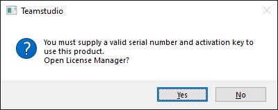
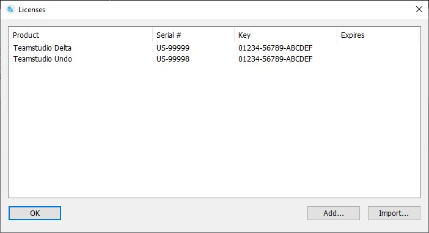

# Initializing Teamstudio Tools

Each Teamstudio client product is protected by a serial number and key. You must initialize each Teamstudio client product before you can use it. You will receive a serial number and key pair with each Teamstudio client license that you purchase.

## To initialize Teamstudio client products
1. From Designer, click the icon for the tool you want to initialize.
2. You see a message asking you if you want to open the License Manager.  
     
   If you choose *No* the tool will terminate.
3. The License Manager is displayed. This shows all of the serial numbers and keys that you currently have installed on your computer.  
     
   If you have any subscription licences, the *Expires* column will show the expiration date of each subscription.
4. The easiest way to add your new key or keys is to locate the email you received from Teamstudio with your serial numbers and keys and copy the entire email to the clipboard. Then return to the License Manager and click the *Import...* button. A new window will display showing all of the key information found in the email. Click *Import Selected* to import the new key information and then click *OK* to close the *Import Licenses* window.
5. If you do not have the email or want to enter keys manually, you can use the *Add...* button to bring up a new window allowing you to add new licenses, one product at a time.
6. You can also right-click on an existing license and either edit it or delete it. You do not need to delete existing licenses before importing new ones - the imported licenses will automatically replace the older ones.
7. Once your changes are complete, click *OK* to close the License Manager. Your tool will now open.

## To Update Serial Numbers and Keys
You can access the License Manager at any time to update your license information. This allows you to update keys without needing to wait for the old key to expire.

The License Manager is available from the Teamstudio About dialog. In most products, this is available from an *About...* button on the main tool window. Once the About dialog is displayed, you can click the *Licenses...* button to launch the License Manager.

!!! note
    The License Manager allows you to update serial numbers and keys for all of your Teamstudio client products, but it is not able to *validate* those keys. Each product is responsible for validating
    its own serial number and key. In other words, the License Manager is not able to detect any errors
    you make entering a serial key. If you still see the prompt asking you to open the License Manager after entering a key then the supplied serial number and key is invalid. We recommend using the *Import* feature to import licenses directly from your email to avoid typing errors.