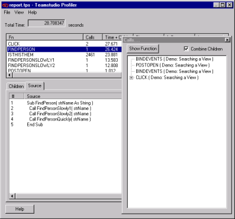

# Using the Call Tree

You can also use the Call Tree to investigate your results. The Call Tree gives you a different way to look at the functions called while Profiler ran.

## To use the Call Tree
1. Click **View > Call Tree**. You see the **Calls** window.
2. Select a function and click the **Show Function** button to automatically highlight that function in the main results pane.  
   
3. Select the **Combine Children** check box so that similar calls appear in the **Calls** window as a single entry.  
   This feature simplifies the tree. For example, if you have a loop that calls a particular function hundreds of times, the call tree will only show that function once. If you uncheck the box, all function calls will appear in the tree even if they are duplicates.
4. When you are finished with your investigation, click **Close**.  
   Profiler will ask if you want to save the file. After you specify where to save it, it is saved as a Profiler snapshot (.tps file).  
   You can also click **File > Save As** to save your report.