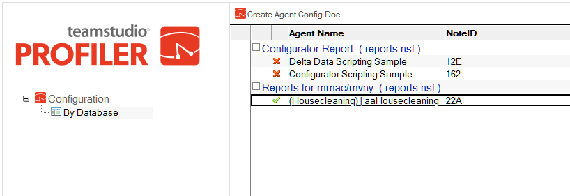
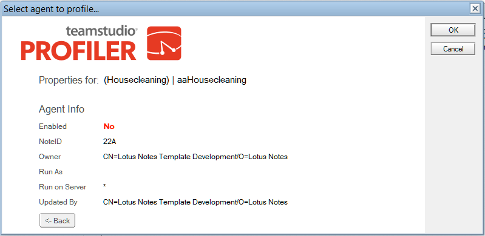

# Profiler 設定データベース

Profilerをサーバーで使用する前に、Profiler設定データベースを作成する必要があります。

## Profiler 設定データベースを作成するには
1. Profiler をサーバーにインストールします。
2. ノーツクライアントから、**[ファイル]>[アプリケーション]>[作成]**をクリッ クします。**[ 新規アプリケーション ]** ウィンドウが表示されます。
3. **[ 新規アプリケーション名と場所の指定 ]** セクションの **[ サーバー]** ドロップダウンで、前の手順でインストールしたサーバーを選択します。
4. **[ タイトル ]** ボックスに、必要なタイトルを入力します。
5. **[ ファイル名 ]** ボックスに、Teamstudio\ProfilerConfig.nsf と入力します。
6. **[ 新規アプリケーションのテンプレートの指定 ]** セクションの **[ サーバー ]** ドロップダウンで、前の手順でインストールしたサーバーを選択します。
7. テンプレートリストから**[TeamstudioProfiler設定]**(profile.ntf)を選択します。
8. **[テンプレートを引き継いで設計]** チェックボックスがオンになっていることを 確認してください。
9. **[OK]** をクリックします。Profiler 設定データベースが作成されます。

## 選択したエージェントをプロファイルするには

1. Profiler 設定データベースを開きます。  
   
2. **[エージェント設定文書を作成]** をクリックしてプロファイルするエージェントを追加します。  
   **[ プロファイルするエージェントを選択してください ]** ウィンドウが表示され ます。
3. **[ 参照 ]** ボタンをクリックして監視するデータベースを選択します。  
   
   

     
Note

     同一サーバー内のデータベースを Profiler 設定データベースとして選択 する必要があります。
   

4. **[ エージェントの表示 ]** ボタンをクリックすると、データベース内のすべてのエージェントが表示されます。
5. ドロップダウンメニューを使ってデータベースからエージェントを選択します。  
   
   

     
Note

     ロータススクリプトエージェントのみが一覧に表示されます。
   

6. **[ エージェントの選択 ]** をクリックしてエージェントを選択します。  
   選択したエージェントの情報が表示されます。  
   
7. **[OK]** をクリックします。  
   次回エージェントが実行されるときに、Profiler が監視を行います。 
      
## 構成ドキュメント
<figure markdown="1">
  
</figure>

この文書内の設定情報は以下のとおりです。

| 情報 | 説明 |
| --- | --- |
| 有効 | **[ 有効 ]** または **[ 無効 ]** を選択して、このエージェントに対する監視の有効/無効を設定します。 |
| エージェント | エージェントの名前。 |
| 実行数 | エージェント情報が収集される回数を指定します。 |
| プロファイルの実行回数 | 設定またはリセットしてからエージェントが実行された回数。 |
| オプション | Profiler ウィンドウ内で選択されたオプションを指定します。<ul><li>関数のエントリポイント:関数のエントリポイントの情報を収集します。</li><li>関数と行: ロータススクリプトの関数と行に関する情報を収集します。</li><li>関数: 関数の情報を収集します。</li></ul> |
| ユーザー | 特定のユーザーによりエージェントが実行されたときのみ Profiler が稼働します。 |
| エージェント署名者 | エージェントの署名に使われる ID ファイル。これは R5 サーバー上で実行されるときのみ必要です。 |
| 署名者のパスワード | 添付 ID のパスワード。 **注記**: のフィールドは暗号化されずに通常のテキスト として保存されます。 |

!!! note
    上記テーブル内のエージェント署名者と署名者パスワードには、いくつかの規制があります。
    
    たとえば、ノーツリリース 6 サーバー上で実行されている場合、これらのフィールドは無視されます。Profiler サーバーはサーバー ID を使って稼働します。リリース 6 では、サーバー ID で署名されたコードを無規制で実行できます。特別な ID で署名する必要はありません。  
    
    しかし、リリース 5 では、デフォルト設定ではサーバーにこれらの権利が与えられていません。Profiler でコードを修正して再度署名すれば、実行できる可能性があります。この問題を避けるには、以下のオプションのいずれかを使用してください。
    
    * サーバー設定文書の [ 制限なし LotusScript エージェントの実行 ] フィールドにサーバー名を追加する。
    * エージェント設定文書に署名者 ID を追加する。
