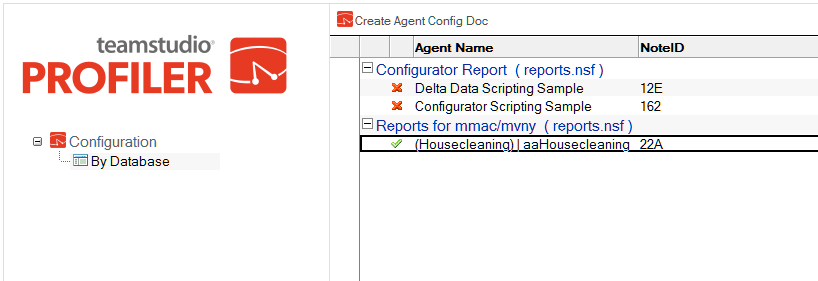
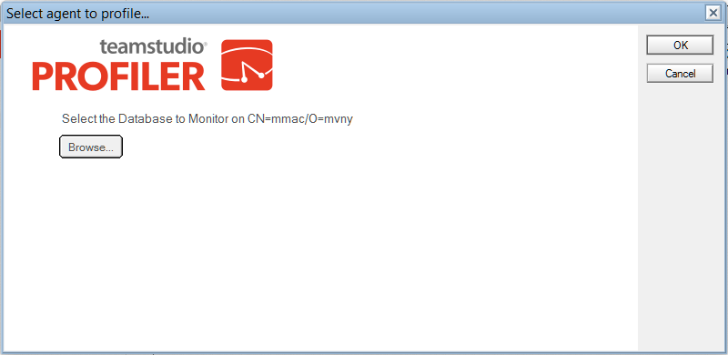
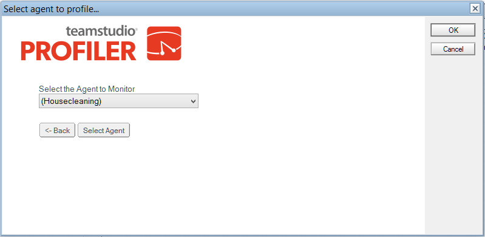
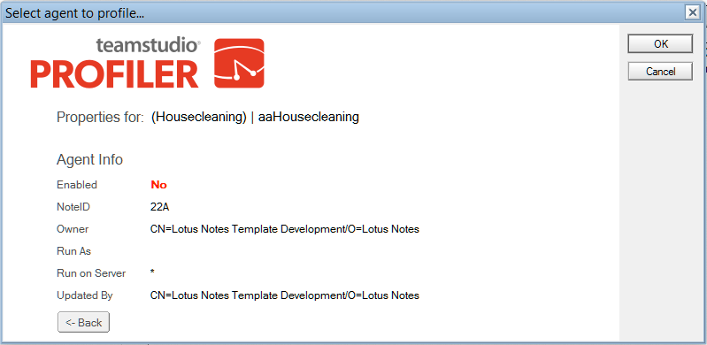
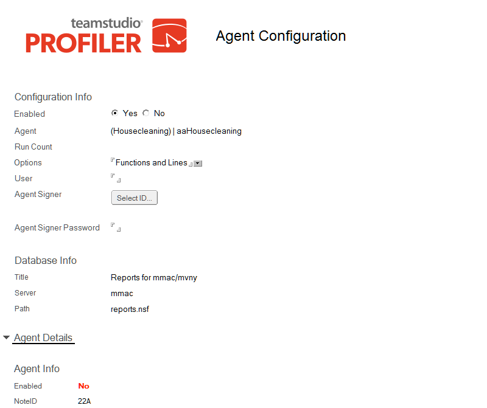

# Profiler Configuration Database

Before you can use Profiler on the server, you must create a Profiler Configuration database.

## To create a Profiler configuration database
1. Install Profiler on your server.
2. From a Notes client, click **File > Application > New**. You see the **New Application** window.
3. From the Server dropdown in the **Specify New Application** section, select the server you just installed to.
4. In the **Title** box, enter the title you want.
5. In the **File Name** box, enter Teamstudio\ProfilerConfig.nsf.
6. From the **Server** dropdown in the **Specify template for New Application** section, select the server you just installed to.
7. From the template list, select **Teamstudio Profiler Configuration** (profile.ntf).
8. Make sure that **Inherit future design changes** check box is selected.
9. Click **OK**.

Your Profiler configuration database has been created.

## To profile selected agents
1. Open the Profiler configuration database.  
   
2. Click Create Agent Config Doc to add an agent to be profiled.  
   You see the Select agent to profile window. 
3. Click the **Browse** button to select a database to monitor.  
   
   

     
Note

     You must select a database on the same server as the Profiler configuration database.
   

4. Click the **Get Agents** button to view all the agents in the database.
5. Use the dropdown to select an agent from the database.  
   
   

     
Note

     Only LotusScript agents will be listed.
   

6. Click **Select Agent** to select an agent.  
   You see information about the agent you selected.  
   
7. Click **OK**.  
   The next time the agent runs, Profiler will collect timing information and create a document in the Profiler Log database on the server.
   
## The Configuration Document
<figure markdown="1">
  
</figure>

The following configuration information is provided in this document:

| Information | Description |
| --- | --- |
| Enabled | Select Yes or No to enable or disable Profiler from monitoring this agent. |
| Agent | The name of the agent. |
| Run Count | Specify how many times Profiler should collect information on an agent. |
| Profiled Runs | The number of times the agent has been run since this was set or reset. |
| Options | Specify an option, as selected on the Profiler window:<ul><li>Function Entry Points - collect information on function entry points</li><li>Functions and Lines - collect information on functions and lines of LotusScript</li><li>Functions - collect information on functions</li></ul> |
| User | Profiler will only run when the agent is triggered by a particular user. |
| Agent Signer | The ID file used to sign agents. This is only required when run on an R5 server. |
| Agent Signer Password | The password for the attached ID. **Note**: This field is not encrypted and is stored as plain text. |

!!! note
    Agent Signer and Agent Signer Password in the above table have some restrictions.
    
    When running on a Notes Release 6 server, these fields can be ignored. Profiler server runs using the Server ID. On Release 6, code signed by the server ID is allowed to run unrestricted. Signing with a special ID is unnecessary.  
    
    On Release 5, however, the server is not granted these rights by default. After Profiler modifies and resigns code, the server may not be able to execute it. To avoid this problem, use one of the following options:
    
    * Add the server name to the Run unrestricted LotusScript agents field on the server configuration document.
    * Add the signer ID to the agent configuration document.
