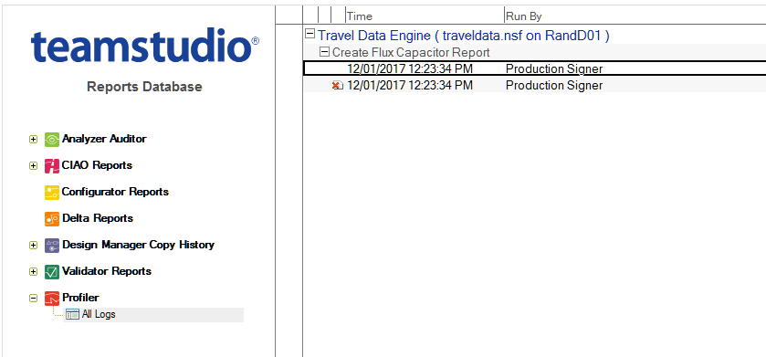
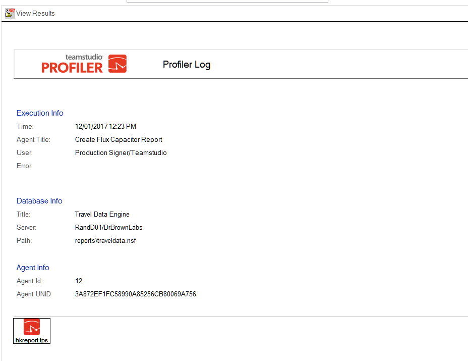

# Profiler ログデータベース

## Profiler ログ情報を参照するには
1. Profiler ログデータベースを開きます。  
     
   時間列内の赤いアイコンは、エラーが発生し、選択されたコード上で Profiler を実行することができなかったことを示します。 
2. 詳細を表示するには、文書を開きます。
   
3. フォーム上部の**[結果の表示]**ボタンをクリックします。Profiler を起動して、添付された結果を表示します。
   

     
Note

     Profiler Client がインストールされている必要があります。      
   
  
   添付書類をハードドライブに保存してから、Profiler をノーツクライアントから起動し、[ ファイル ] > [ 開く ] をクリックしてファイルを開くこともできます。
