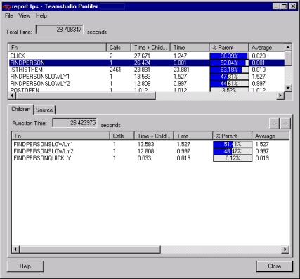
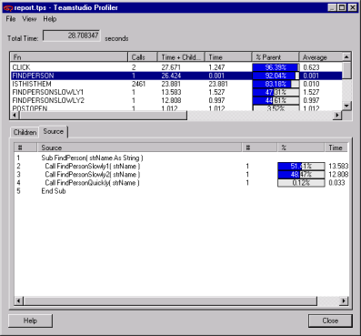

# Profiler 結果の参照 

**[ 合計時間 ]** フィールドには、アプリケーションが稼働した合計時間が表示 されます。デフォルトでは時間単位は秒に設定されています。

* 秒からミリ秒、またはミリ秒から秒に切り替えるには、**[ 表示 ] > [ 単位 ]** をク リックします。
* 列で並べ替えるには、その列のタイトルをクリックします。

ペイン(画面上部)に、Profiler の収集処理中に稼働していた関数のリスト が表示されます。

| 列 | 説明 |
| --- | --- |
| 関数 | 関数名 |
| コール数 | 関数が呼び出された回数 |
| 時間 + 子関数時間 | 関数とその子関数の実行にかかった時間の合計 |
| 時間 | 関数の実行にかかった時間 |
| 親関数に対する比率 | 呼び出し元の関数に対する、関数の実行にかかった合計時間の比率 |
| 平均時間 | 関数を 1 回実行するのにかかった時間の平均 |
| 時間 + 子関数時間の平均値 | 関数とその子関数が各コールを実行するのにかかった時間の平均(時間 + 子関数時間)/コール数)|
| 要素 | コードを含む設計要素の名前 |
| 項目 | コードを含むノーツ項目の名前 |

Profiler では、以下の命名規則を使ってクラスおよびメソッドを表します。
```
< クラス名 >::< メソッド名 >
```

## Profiler 結果を使用するには
1. 画面上のペインで、さらに調査する関数を選択します。  
   画面下のペインに、より詳しい情報が表示されます。デフォルトでは [ 子関数 ] タブが選択されています。サマリペインから選択された関数がコールした関数のリストが、[ 子関数 ] タブに表示されます。  
     
   <div>この例の場合、FINDPERSON 関数は以下の 3 つの子関数をコールしました。
    <ul><li>FINDPERSONSLOWLY1</li>
    <li>FINDPERSONSLOWLY2</li>
    <li>FINDPERSONQUICKLY</li></ul>
   最初の 2 つの子関数が FINDPERSON 関数の時間の大部分を占めているため、より詳しい調査が必要になります。
   <div class="admonition">
     <p class="admonition-title">Note</p>
     <ul><li>Print や Message Box のようなロータススクリプト言語関数は、子関数に含まれません。NotesDocument や NotesDatabase のような Product クラスも含まれません。</li>
     <li>詳細ペインに表示される時間は、親関数の時間に対する相対値です。</li></ul>
   </div></div>
2. **[ 子関数 ]** タブで関数をダブルクリックすると、その子関数の情報が表示されます。
3. **[子関数]** タブの上部にある矢印ボタンを使って、子関数のレベルを変更します。
4. **[ ソース ]** タブをクリックすると、ロータススクリプトソースが表示されます。  
     
   この例では、行番号 2 の処理に最も時間がかかったことがわかります。
