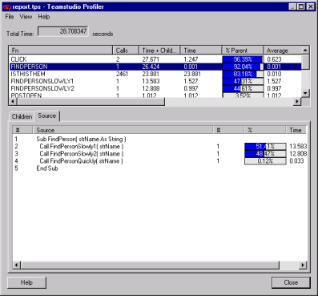

# Reviewing Profiler Results

The **Total Time** field reports the number of seconds that your application ran. Seconds are the default units of time.

* Click View > Units to change from seconds to milliseconds, or milliseconds to seconds.
* Click a column heading to sort by that column.

The pane at the top shows the list of functions that were running during Profiler's collection interval and information about those functions.

| Column | Description |
| --- | --- |
| Fn | The function name. |
| Calls | The number of times the function was called. |
| Time + Children | The combined time including the time the function took plus the time its child functions took to execute. |
| Time | The time the function took. |
| % Parent | The percentage of total time that the function took to run in relation to the calling function. |
| Average | The average time the function took to run once. |
| Average + Children | The average time taken by the function and its children for each call ((time + children)/calls). |
| Element | The name of the design element in which the code is located. |
| Item | The name of the NoteItem in which the code is located. |

Profiler uses the following naming convention to represent classes and methods:
```
<class name>::<method name>
```

## To work with Profiler Results
1. In the upper pane, select a function you want to investigate further.  
   You see more detailed information in the lower pane, with the Children tab selected by default. The function selected in the Summary pane called the functions listed in the Children tab.  
     
   <div>In the example, the `FINDPERSON` function called the three child functions listed:
    <ul><li>FINDPERSONSLOWLY1</li>
    <li>FINDPERSONSLOWLY2</li>
    <li>FINDPERSONQUICKLY</li></ul>
   The first two child functions took most of the FINDPERSON function's time, which may warrant further investigation.
   <div class="admonition">
     <p class="admonition-title">Note</p>
     <ul><li>Child functions do not include LotusScript language functions such as Print or Message Box. They also do not include Product Classes such as NotesDocument or NotesDatabase.</li>
     <li>Time in the Detail pane is relative to the Parent function's time.</li></ul>
   </div></div>
2. Double-click a function on the Children tab to view information about its child functions.
3. Use the arrow buttons at the top of the Children tab to go between levels of child functions.
4. Click the Source tab to view LotusScript source.  
     
   The example shows that line number 2 took the most time.
