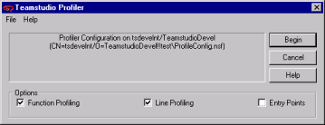
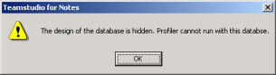
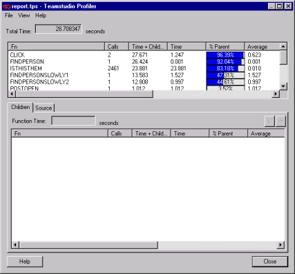

# Running Profiler

To run Profiler with your application, you select your target database, specify Profiler configuration settings, run your application, and then stop Profiler.
 
!!! note
    Because of the way the Notes Client performs caching, you should restart the Notes Client before running Profiler. 
    
## To Start Teamstudio Profiler
1. In Designer, open the application you want to profile.
2. Click the Profiler button on the toolbar.  
   You see the Teamstudio Profiler window with the name of your database in the top field.  
   
   
!!! note
    Profiler will not let you profile a database that has a hidden design. An error will appear.  
      
    Click OK to accept the error and the Teamstudio Profiler window will appear. The Begin button will be inactive. 

## Setting Profiler Options
You can set Profiler options as shown in the following table.

| Option | Description |
| --- | --- |
| Function Profiling | Collect timing information on functions. If you choose this option, you can also choose the Entry Points option. |
| Line Profiling | Collect timing information on lines of LotusScript. This option gives the most detail. |
| Entry Points | Collect information on entry points to a function. Entry Points are functions like Initialize, Terminate, Click and Bind Events. This option gives the least detail, and can show you where to start. You can only select this if you have also selected the Function Profiling option. |

!!! note
    Line profiling is not available for code included from .lss files.

## To begin profiling
1. From the Profiler window, click Begin to start Profiler.
2. Open your database and use it as you normally would to trigger the code that you want to profile.

!!! note
    Do not save things in Designer while Profiler is running. Unpredictable results will occur.
    
## To view the results Profiler has collected
1. When you are finished, click the Profiler icon to stop Profiler.
2. You see the Teamstudio Profiler results window.  
   
