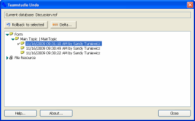

# Undoing a Change

## To rollback database design element changes
1. From Designer, click the Undo button on the toolbar.  
   You see the **Teamstudio Undo** window with the following element change information:  
   The design element type, the element name, the changes in the order they were made, the date and time of the changes and the signature before the changes were made.  
   
   

     
Note

     
If you select a database icon from the Notes workspace and then click Undo, you'll be prompted to browse to the database file. You can avoid having to browse to the database file by first opening the file in Designer and then clicking Undo from the toolbar.

   

2. Select version of the design element you want to roll back to.
3. Click **Rollback to selected**.  
   The copy of the design element captured at that time will replace the design element in the database.