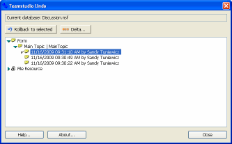

# Viewing Design Element Changes

!!! note
    Undo does not keep track of changes to documents.
    
## To View Design Element Changes
1. From Designer, click the Undo button on the toolbar to open the Undo window.
   
   

     
Note

     
If you select a database icon from the Notes workspace and then click Undo, you'll be prompted to browse to the database file. You can avoid having to browse to the database file by first opening the file in Designer and then clicking Undo from the toolbar.

   

2. Select the version of the design element you want to view changes for.
3. Click the **Delta** button to view the difference between the element in the undo buffer and its current version.
4. Click **Close** to return to the Undo client.

!!! note
    You can also use Delta to compare two undo buffer design element versions.
    
    1. Select one version.
    2. Press and hold the CTRL key.
    3. Select the second version (the two elements must be of the same type.)
    4. Click the **Delta** button.
    
See [Using Delta](../delta/using.md) for more information on using Delta.