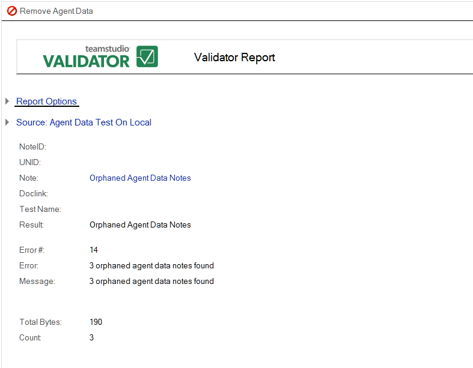

# オーファンドエージェントノート

このテストでは、データベースをスキャンして、エージェントによって現在は参照されていないエージェントデータノートを特定します。エージェントデータノートは、実行時にエージェントによって作成され使用された設計要素です。時間の経過と共に、データベースで何百ものこれらの要素が蓄積されて、データベースのサイズが大きくなることがあります。オーファンドエージェントデータノートの大部分はエージェントに関連付けら れていないため、削除されることはありません。オーファンドエージェン トデータノートは Designer に表示されないので、簡単に削除する方法はありません。

次の図は、オーファンドエージェントを示す Validator レポートの例です。
<figure markdown="1">
  
</figure>

このレポートには、前述の共通情報だけが表示されます。  

## レポートのオーファンドエージェントデータノートを削除するには
* このレポートで参照されているオーファンドエージェントデータノートを削除するには、ウィンドウの上部にある **[ エージェント・データを削除 ]** ボタンをクリックします。

## すべてのオーファンドエージェントデータノートを削除するには
1. **[ オーファンドエージェントデータノート ]** というビューにジャンプします。
2. オーファンドエージェントデータノートを削除するには、ウィンドウの上部にある **[ エージェント・データを削除 ]** ボタンをクリックします。

 
