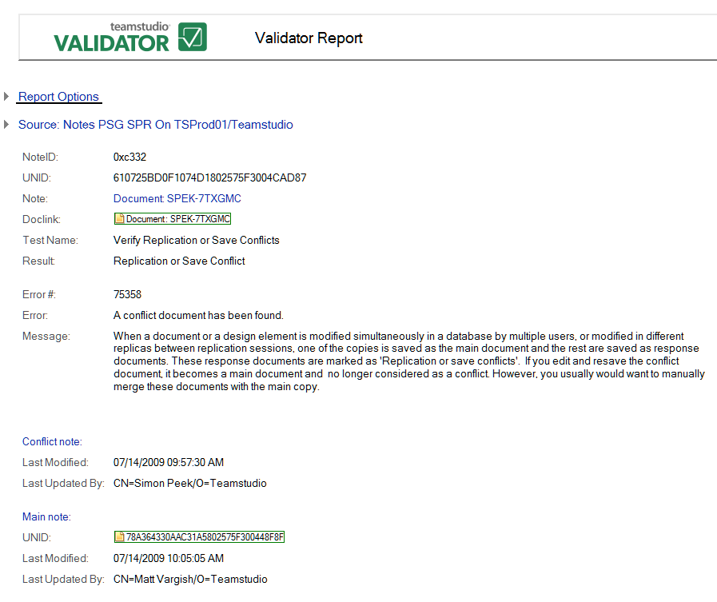

# 保存時または複製時の競合

このテストでは、次のような保存時または複製時の競合が検出されます。

* 文書や設計要素が複数のユーザーによりデータベースで同時に変更されたときに生じた競合。
* 文書や設計要素がセッション間の異なるレプリカで変更されたときに生じた競合。
* 文書のコピーの 1 つが主要文書として保存され、その他のコピーが返答文書として保存されたときに生じた競合。返答文書は [ 複製または保存の競合 ] としてマークされます。競合文書を編集して再保存すると、その文書が主要文書となり競合と見なされなくなります。ただし、これらの文書は通常、主要コピーにマージします。

次の図は、保存時または複製時の競合を示す Validator レポートの例です。
<figure markdown="1">
  
</figure>

レポートすべてに共通な情報に加えて、 **[ 保存時または複製時の競合 ]** レポートでは次の情報が表示されます。

| フィールド | 説明 |
| --- | --- |
| **競合要素**: | |
| 最終更新日 | 競合するノートの最終更新日。 |
| 最終更新者 | このノートの最終更新を行ったユーザー。 |
| **メイン要素**: | |
| UNID | 新規作成されたノートに割り当てられる 16 バイト値。この値によってノートが一意に識別されます。 |
| 最終更新日 | 主要ノートの最終更新日。 |
| 最終更新者 | このノートの最終更新を行ったユーザー。 |
 