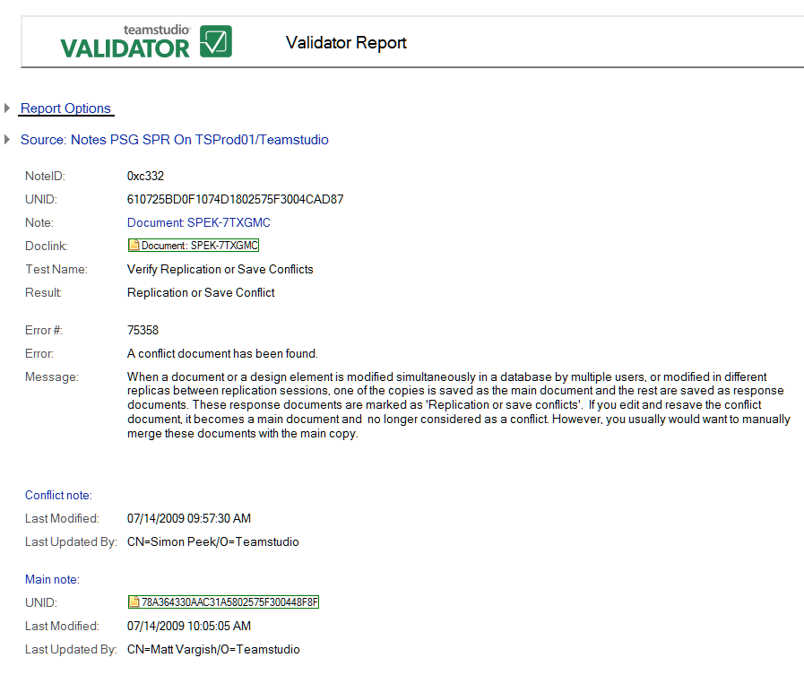

# Save or Replication Conflicts

This test finds save/replication conflicts including the following:

* Conflicts created when a document or a design element is changed simultaneously in a database by multiple users.
* Conflicts created when a document or design element is changed in different replicas between replication sessions.
* Conflicts created when one copy of a document is saved as the main document and the other copies are saved as response documents. The response documents are marked as *Replication or save conflicts*. If you edit and resave the conflict document, it becomes a main document and is no longer considered in conflict, however, you typically should merge these documents with the main copy.

The following is an example of a Validator report showing a save/replication conflict.
<figure markdown="1">
  
</figure>

In addition to the information common to all reports, the **Save/Replication Conflicts** report shows the following:

| Field | Description |
| --- | --- |
| **Conflict note**: | |
| Last Modified | The date the note in conflict was last modified. |
| Last Updated By | The last user to update this note. |
| **Main note**: | |
| UNID | The 16-byte value that is assigned to a note when the note is first created. This value uniquely identifies a note. |
| Last Modified | The date the main note was last modified. |
| Last Updated By | The last user to update this note. |
 