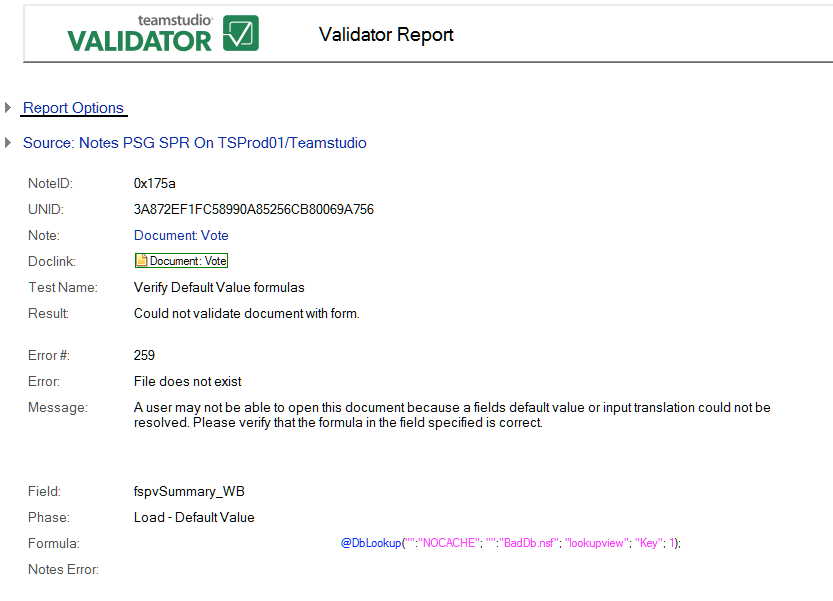

# フォームを使って文書を検証できませんでした

このテストでは、文書に保存された値に対して、デフォルト値および Input Translation または Input Validation の式が計算されます。次はその例です。
<figure markdown="1">
  
</figure>

レポートすべてに共通な情報に加えて、**[ フォームを使って文書を検証でき ませんでした ]** レポートでは次の情報が表示されます。

| フィールド | 説明 |
| --- | --- |
| フィールド | 式が検出されたフィールド。 |
| 検証段階 | このエントリには、次の値のいずれかが表示されます。<ul><li><i>ロード - Default Value</i>: フィールドのデフォルト値の確認中に 発生したエラーです。</li><li><i>保存 - Input Translation</i>: フィールドの Input Translation 式で発 生したエラーです。</li><li><i>データ変換</i>: 文書内データのフィールド種類への変換中(テキストから数字への変換中など)に発生したエラーです。</li></ul> |
| 式 | 異常のある式。 |
| ノーツエラー | ノーツのエラー分析結果(利用可能な場合)。 |
