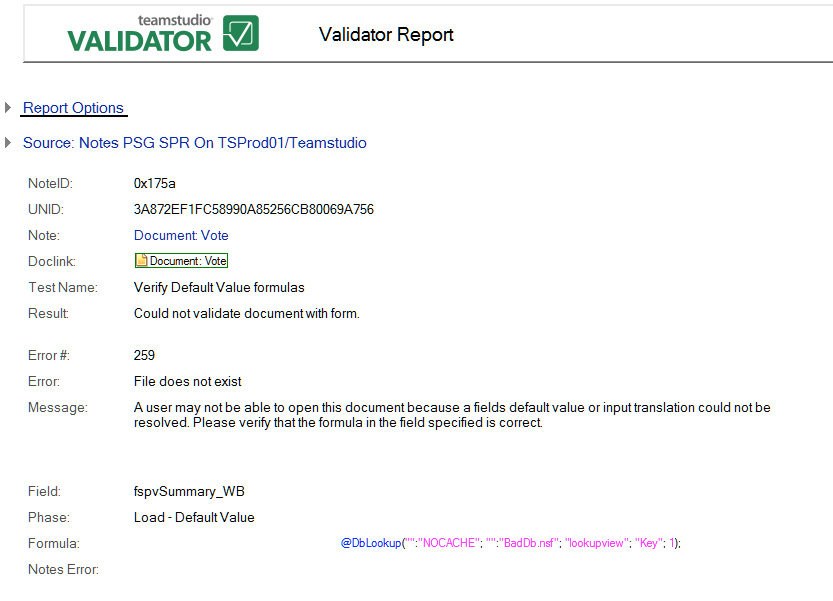

# Could Not Validate Document with Form

This test attempts to calculate the default value formula and the input translation/ validation formula against values stored in the document. The following is an example:
<figure markdown="1">
  
</figure>

In addition to the information common to all reports, the **Could Not Validate Document With Form** report shows the following:

| Field | Description |
| --- | --- |
| Field |Field where the formula was found. |
| Phase | This entry can have the following values:<ul><li><i>Load - Default value</i>: An error occurred while checking the field's default value</li><li><i>Save - Input Translation</i>: An error occurred in the field's input translation formula</li><li><i>Data Conversion</i>: An error occurred when trying to convert the data in the document to the type of the field (for example, text to number)</li></ul> |
| Formula | The failing formula. |
| Notes Error | The resulting Notes error, if available. |
