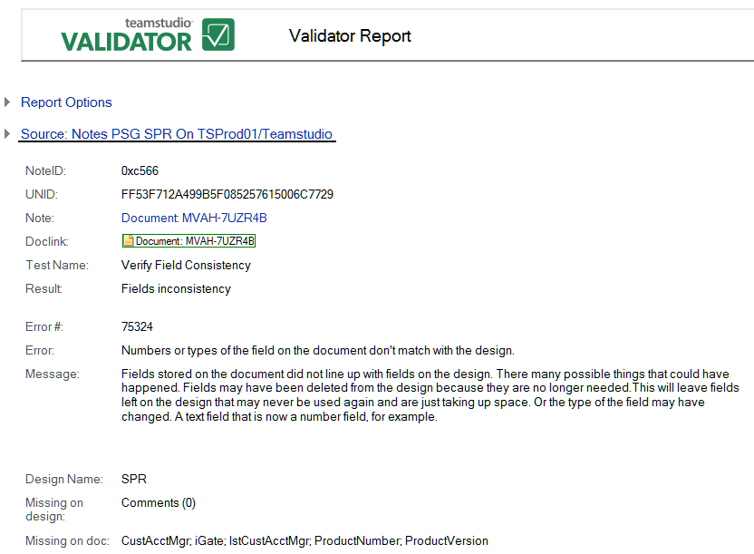

# フィールドの不整合

文書に保存されたフィールドが設計のフィールドと一致していません。たとえば、不要なフィールドが設計から削除された可能性があります。この場合、使用されることのないのフィールドが設計に残り、容量を無駄に消費してしまうことになります。または、フィールドの種類が変更されている可能性があります(例:テキストフィールドが数値フィールドに変更されているなど)。
 
次はその例です。 
<figure markdown="1">
  
</figure>

レポートすべてに共通な情報に加えて、**[ フィールドの不整合 ]** レポートでは次の情報が表示されます。

| フィールド | 説明 |
| --- | --- |
| 設計要素名 | この文書に使用されたフォームの名前。 |
| 設計に欠けているフィールド | 文書内に存在するが、設計内で失われているフィールドを一覧表示します。括弧内に文書のフィールドサイズも表示されます(例: [ フィールド名(サイズ)])。 |
| 文書に欠けているフィールド | 設計内に存在するが、文書内に存在しないフィールドを一覧表示します。 |
| 種類が異なるフィールド | 設計内と文書内のフィールドの種類の違いが説明されます。 |
| 文書に格納される表示用の計算結果フィールド | 文書に格納されたCFDフィールド数を表示します。括弧内にフィールドサイズも表示されます(例:[フィールド名(サイズ)])。 |