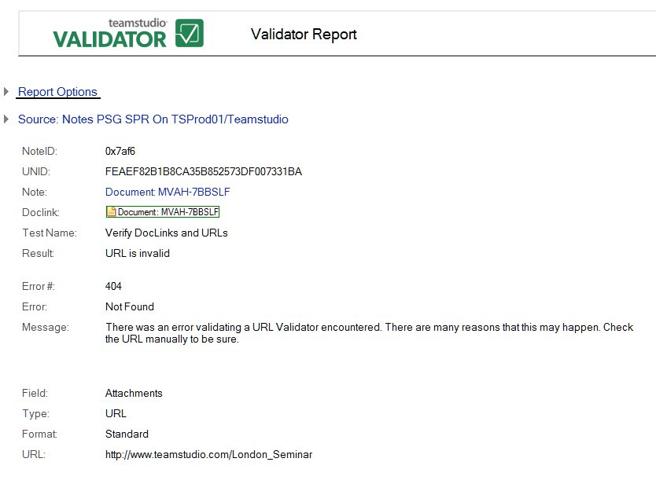

# 無効な URL

このエラーは、Validator で URL の検証中にエラーが発生したことを示します。URL を手動で確認してください。

!!! note
    Validator の HTTP 要求に対するサーバーの応答時間は 20 秒に設定されています。この値は、次の式を teamstudio.ini の Validator セクションに追加する ことにより、カスタマイズできます。 
    ```
    LINKURLTimeOut = TIME IN MILISECONDS 
    ```

次のエラーが報告されます。

* 見つかりませんでした。
* 処理がタイムアウトになりました。
* サーバー名またはアドレスは解決されませんでした。

次は、[ 無効な URL] エラーレポートの例です。
<figure markdown="1">
  
</figure>

レポートすべてに共通な情報に加えて、**[ 無効な URL]** レポートでは次の情報が表示されます。

| フィールド | 説明 |
| --- | --- |
| フィールド | URL が見つかったフィールド。 |
| 種類 | リンクの種類。この場合は、URL です。 |
| 値の形式 | URL の保存形式。この場合は、式です。 |
| URL | 異常のある URL。 |
| 近くの文字 | 異常のあった文書リンク周辺のテキスト。修正する際の手がかりとしてください。 |
