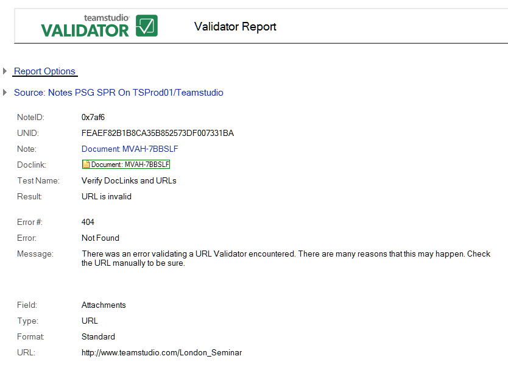

# URL is Invalid

This error means that there was an error validating a URL that Validator encountered. Check the URL manually.

!!! note
    Validator will wait twenty seconds for a server to respond to an HTTP request. You can customize this value by adding the following to the Validator section in teamstudio.ini:  
    ```
    LINKURLTimeOut = TIME IN MILISECONDS 
    ```

Reported errors can include the following:

* Not found
* The operation is timed out
* The server name or address could not be resolved

The following is an example of a URL is Invalid error report:
<figure markdown="1">
  
</figure>

In addition to the information common to all reports, the **URL is Invalid** report shows the following:

| Field | Description |
| --- | --- |
| Field | Field the URL was found in. |
| Type | Type of link, in this case URL. |
| Format | How the URL is stored, in this case in a formula. |
| URL | The failing URL. |
| Nearby Text | Text near the failing doclink, provided as a hint. |
