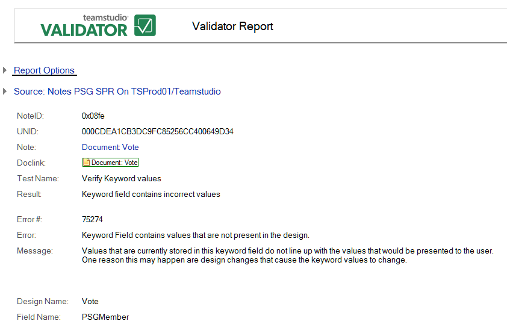

# 不正な値をもつキーワードフィールド

このキーワードフィールドに現在保存されている値が、ユーザーに表示される値と一致していません。この原因の 1 つに、設計変更によるキーワード値の変更があります。

次はその例です。 
<figure markdown="1">
  
</figure>

レポートすべてに共通な情報に加えて、**[ 不正な値をもつキーワードフィールド ]** レポートでは次の情報が表示されます。

| フィールド | 説明 |
| --- | --- |
| 設計要素名 | この文書に使用されたフォームの名前。 |
| フィールド名 | 異常のあるフィールドの名前。 |
| 不明の値 | フィールド内に含まれているが、設計では有効でない値の一覧。 |
| 許可された値 | ユーザーが選択できる値の一覧。 |
