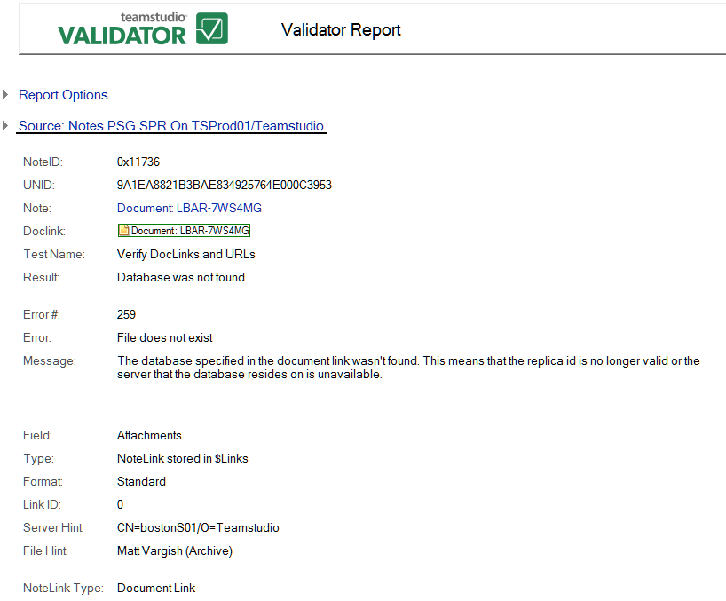

# データベースは見つかりませんでした

文書リンクで指定されたデータベースが見つかりません。レプリカ ID がすでに有効でないか、データベースを保存するサーバーが使用できないことを示します。

次のエラーが報告されます。

* ファイルがありません。
* ファイルが見つからないかノーツのデータベースではありません。
* 操作を実行する権限がありません。

次はその例です。

<figure markdown="1">
  
</figure>

レポートすべてに共通な情報に加えて、**[ データベースは見つかりませんでした ]** レポート(文書リンクレポートのみ)では次の情報が表示されます。

| フィールド | 説明 |
| --- | --- |
| フィールド | リンク先が見つかった文書内のフィールド。 |
| 種類 | リンクの種類(例:[ 文書リンク ] または [URL])。 |
| 値の形式 | リンクの保存形式(例:標準、計算結果、または特殊)。 |
| 要素名 | 名前付き要素リンク([ 種類 ] が [ 名前付き要素 ] の場合のみ)でリンクしている要素名。 |
| ノートリンクの種類 | ノートリンクの種類(例:[ 名前付き要素 ]、[ 文書リンク ])。 |
| DBID | データベースの RepID。 |
| ビュー | ビューの UNID。 |
| 注記 | ノートの UNID。 |
| 近くの文字 | エラー周辺のテキスト。修正する際に手がかりとしてください。 |

!!! note
    文書リンクは、DBID、ビュー、およびノートで構成されます。データベースの文書リンクを検索するのに、それぞれがノーツで有効である必要があります。