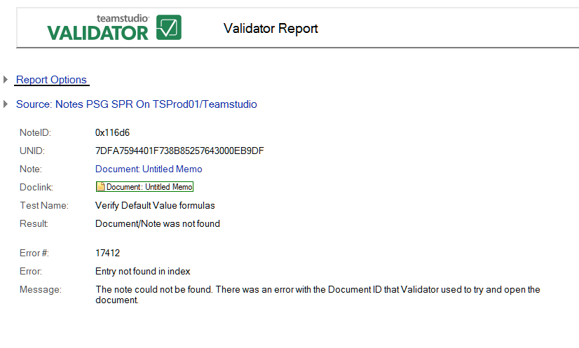

# 文書／要素は見つかりませんでした

このエラーは、要素が見つからなかったことを示します。Validator が文書を開く際に使用した文書 ID に、エラーがあります。

次のエラーが報告されます。

* 名前付き要素の参照が無効です。( タイプ : 名前 )
* エントリが索引に見つかりません。

次はその例です。 
<figure markdown="1">
  
</figure>

レポートすべてに共通な情報に加えて、**[ 文書/要素は見つかりませんでした ]** レポートでは次の情報が表示されます。

| フィールド | 説明 |
| --- | --- |
| フィールド | リンク先が見つかった文書内のフィールド。 |
| 種類 | リンクの種類(例:[ 文書リンク ] または [URL])。 |
| 値の形式 | リンクの保存形式(例:標準、計算結果、または特殊)。 |
| ノートリンクの種類 | ノートリンクの種類(例:[ 名前付き要素 ]、[ 文書リンク ]、または [ アンカーリンク ])。 |
| DBID | データベースの RepID。 |
| ビュー | ビューの UNID。 |
| 注記 | ノートの UNID。 |
| 近くの文字 | エラー周辺のテキスト。修正する際に手がかりとしてください。 |
