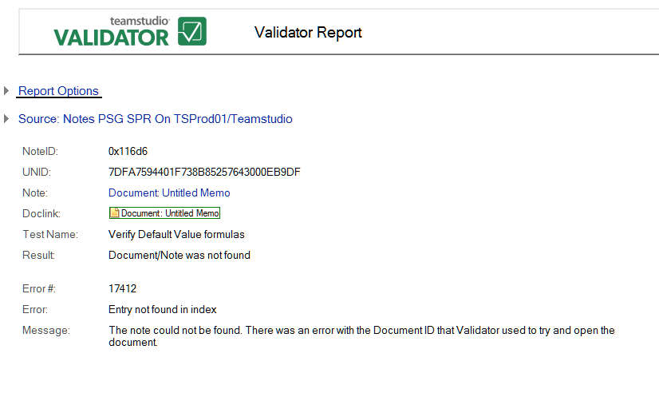

# Document or Note was not Found

This error means that the element could not be found. There was an error with the Document ID that Validator used to try to open the document.

Reported errors can include the following:

* Bad named element reference (Type: Name)
* Entry not found in index

The following is an example:
<figure markdown="1">
  
</figure>

In addition to the information common to all reports, the **Document/Note Was Not Found** report shows the following:

| Field | Description |
| --- | --- |
| Field | The field on the document where the link was found. |
| Type | The type of link (for example, DocLink or URL). |
| Format | How the link was stored (for example, standard, computed or special). |
| NoteLink Type | Type of NoteLink (For example, Named Element, DocLink or Anchor Link). |
| DBID | Database RepID. |
| View | View UNID. |
| Note | Note UNID. |
| Nearby Text | Text near the error, provided as a hint. |
