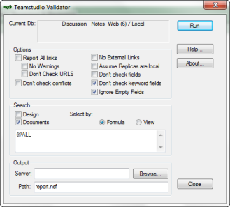

# Starting Validator

From Designer, click the Validator button on the toolbar.

You see the Validator window with the name of the database you selected in the **Current Db** box. 

<figure markdown="1">
  
</figure>