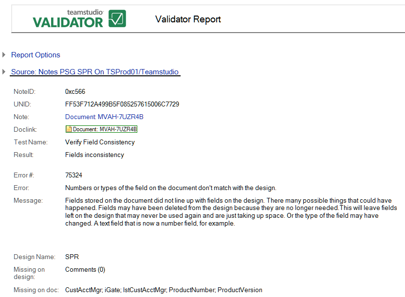

# エラーの表示

Validator エラーを表示するには、レポート文書を選択します。
<figure markdown="1">
  
</figure>

Validator レポートには、次の情報が表示されます。

* 選択したオプション
* データベース情報
* エラーに関する情報
* エラーの発生箇所に関する情報

これらの情報を使用し、データベース設計を修正します。

## 共通情報
次の情報は、すべての Validator レポートで共通です。

| フィールド | 説明 |
| --- | --- |
| 実行時刻 | Validator によりレポートが生成された時刻。 |
| オプション | レポート実行時に設定されたオプション(例:有効なリンクだけを含め、空のフィールドを無視する)。 |
| タイトル | 検索されたデータベース名。 |
| サーバー | 検索されたデータベースのサーバーの場所。 |
| データベース | レポートが実行されたデータベース。 |
| NoteID | 異常のある要素の Note ID。 |
| UNID | 新規作成されたノートに割り当てられる 16 バイト値。この値によってノートが一意に識別されます。 |
| 注記 | 要素名 |
| 文書リンク | 異常のある文書へリンクしている文書リンク。 |
| 検証内容 | テスト実行の種類。これは、内部で定義されるため、カスタマイズできません。 |
| 結果 | テストの結果(例:「データベースは見つかりませんでした」)。 |
| エラー番号 | エラー番号(例:259)。これは、内部で定義されるため、カスタマイズできません。 |
| メッセージ | 可能性のあるエラーの原因についての情報。 |
