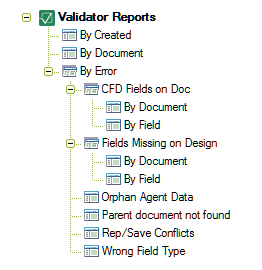

# Validator レポートビュー

レポートデータベースには、次のビューがあります。 
<figure markdown="1">
  
</figure>

## 作成日別
**[ 作成日別 ]** ビューには、検索されたすべてのエラーが作成日別に一覧表示 されます。  
 
## 文書別
**[ 文書別 ]** ビューには、検索されたすべてのエラーがノート(要素)ID の昇 順で一覧表示されます。
 
## エラー別
**[ エラー別 ]** ビューには、検索されたエラーすべてがエラータイプ別に一覧表示されます。Validator には、次のサブビューが用意されています。

* 文書の表示用の計算結果 (CFD) フィールド(文書別またはフィールド別)
* 設計に欠けているフィールド(文書別またはフィールド別)
* オーファンドエージェントデータ
* 親文書が見つかりません
* 複製時または保存時の競合
* 不正なフィールド種類
