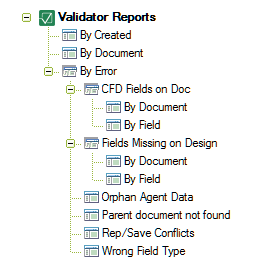

# Understanding Validator Report Views

The report database provides the following views:
<figure markdown="1">
  
</figure>

## By Created
The By Created view lists all errors found by the order created. 
 
## By Document
The By Document view lists all errors found by order of ascending note (element) ID. 
 
## By Error
The **By Error** view lists all errors found by error type. Validator provides the following sub-views:

* Computed for Display (CFD) Fields on Doc (by Document or Field)
* Fields Missing on Design (by Document or Field)
* Orphan Agent Data
* Parent document not found
* Rep/Save Conflicts
* Wrong Field Type
